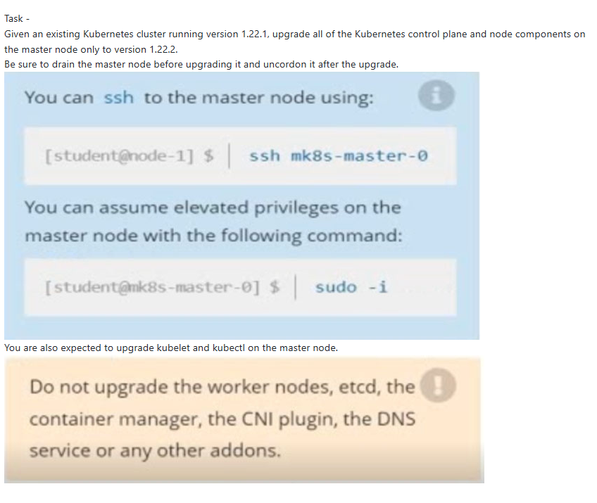

Given an existing Kubernetes cluster running version 1.22.1, upgrade all of the Kubernetes control plane and node components on the master node only to version 1.22.2.

Be sure to drain the master node before upgrading it and uncordon it after the upgrade.

```bash
# Cordon and Drain the master node first
kubectl cordon mk8s-master-0
kubectl drain mk8s-master-0
```

```bash
# verify kubeadm, kubelet and kubectl
kubeadm version
kubelet --version
kubectl version
```

```
apt update
apt-cache madison kubeadm
```

```bash
# upgrade kubeadm
apt update
apt-cache madison kubeadm

apt-mark unhold kubeadm && \
apt-get update && apt-get install -y kubeadm='1.22.2-00' && \
apt-mark hold kubeadm

kubeadm version # verify that download works!
```

```bash
# Prepare upgrade of kubeadm
kubeadm upgrade plan
kubeadm upgrade apply v1.22.2
```

https://v1-28.docs.kubernetes.io/docs/tasks/administer-cluster/kubeadm/kubeadm-upgrade/#upgrade-kubelet-and-kubectl

```bash
#Upgrade kubectl and kubelet
apt-mark unhold kubelet kubectl && \
apt-get update && apt-get install -y kubelet='1.22.2-00' kubectl='1.22.2-00' && \
apt-mark hold kubelet kubectl

sudo systemctl daemon-reload
sudo systemctl restart kubelet
```

# post upgrade

```bash
# verify kubeadm, kubelet and kubectl
kubeadm version
kubelet --version
kubectl version
```

```bash
kubectl uncordon <node>

kubectl get nodes
```
Given an existing Kubernetes cluster running version 1.22.1, upgrade all of the Kubernetes control plane and node components on the master node only to version 1.22.2.

Be sure to drain the master node before upgrading it and uncordon it after the upgrade.

```bash
# Cordon and Drain the master node first
kubectl cordon mk8s-master-0
kubectl drain mk8s-master-0
```

```bash
# verify kubeadm, kubelet and kubectl
kubeadm version
kubelet --version
kubectl version
```

```
apt update
apt-cache madison kubeadm
```

```bash
# upgrade kubeadm
apt update
apt-cache madison kubeadm

apt-mark unhold kubeadm && \
apt-get update && apt-get install -y kubeadm='1.22.2-00' && \
apt-mark hold kubeadm

kubeadm version # verify that download works!
```

```bash
# Prepare upgrade of kubeadm
kubeadm upgrade plan
kubeadm upgrade apply v1.22.2
```

https://v1-28.docs.kubernetes.io/docs/tasks/administer-cluster/kubeadm/kubeadm-upgrade/#upgrade-kubelet-and-kubectl

```bash
#Upgrade kubectl and kubelet
apt-mark unhold kubelet kubectl && \
apt-get update && apt-get install -y kubelet='1.22.2-00' kubectl='1.22.2-00' && \
apt-mark hold kubelet kubectl

sudo systemctl daemon-reload
sudo systemctl restart kubelet
```

# post upgrade

```bash
# verify kubeadm, kubelet and kubectl
kubeadm version
kubelet --version
kubectl version
```

```bash
kubectl uncordon <node>

kubectl get nodes
```)


Given an existing Kubernetes cluster running version 1.22.1, upgrade all of the Kubernetes control plane and node components on the master node only to version 1.22.2.

Be sure to drain the master node before upgrading it and uncordon it after the upgrade.

```bash
# Cordon and Drain the master node first
kubectl cordon mk8s-master-0
kubectl drain mk8s-master-0
```

```bash
# verify kubeadm, kubelet and kubectl
kubeadm version
kubelet --version
kubectl version
```

```
apt update
apt-cache madison kubeadm
```

```bash
# upgrade kubeadm
apt update
apt-cache madison kubeadm

apt-mark unhold kubeadm && \
apt-get update && apt-get install -y kubeadm='1.22.2-00' && \
apt-mark hold kubeadm

kubeadm version # verify that download works!
```

```bash
# Prepare upgrade of kubeadm
kubeadm upgrade plan
kubeadm upgrade apply v1.22.2
```

https://v1-28.docs.kubernetes.io/docs/tasks/administer-cluster/kubeadm/kubeadm-upgrade/#upgrade-kubelet-and-kubectl

```bash
#Upgrade kubectl and kubelet
apt-mark unhold kubelet kubectl && \
apt-get update && apt-get install -y kubelet='1.22.2-00' kubectl='1.22.2-00' && \
apt-mark hold kubelet kubectl

sudo systemctl daemon-reload
sudo systemctl restart kubelet
```

# post upgrade

```bash
# verify kubeadm, kubelet and kubectl
kubeadm version
kubelet --version
kubectl version
```

```bash
kubectl uncordon <node>

kubectl get nodes
```

Given an existing Kubernetes cluster running version 1.22.1, upgrade all of the Kubernetes control plane and node components on the master node only to version 1.22.2.

Be sure to drain the master node before upgrading it and uncordon it after the upgrade.

```bash
# Cordon and Drain the master node first
kubectl cordon mk8s-master-0
kubectl drain mk8s-master-0
```

```bash
# verify kubeadm, kubelet and kubectl
kubeadm version
kubelet --version
kubectl version
```

```
apt update
apt-cache madison kubeadm
```

```bash
# upgrade kubeadm
apt update
apt-cache madison kubeadm

apt-mark unhold kubeadm && \
apt-get update && apt-get install -y kubeadm='1.22.2-00' && \
apt-mark hold kubeadm

kubeadm version # verify that download works!
```

```bash
# Prepare upgrade of kubeadm
kubeadm upgrade plan
kubeadm upgrade apply v1.22.2
```

https://v1-28.docs.kubernetes.io/docs/tasks/administer-cluster/kubeadm/kubeadm-upgrade/#upgrade-kubelet-and-kubectl

```bash
#Upgrade kubectl and kubelet
apt-mark unhold kubelet kubectl && \
apt-get update && apt-get install -y kubelet='1.22.2-00' kubectl='1.22.2-00' && \
apt-mark hold kubelet kubectl

sudo systemctl daemon-reload
sudo systemctl restart kubelet
```

# post upgrade

```bash
# verify kubeadm, kubelet and kubectl
kubeadm version
kubelet --version
kubectl version
```

```bash
kubectl uncordon <node>

kubectl get nodes
```