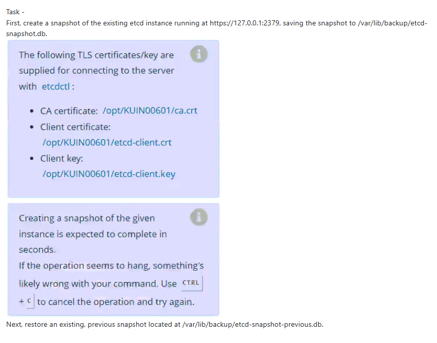

First, create a snapshot of the existing etcd instance running at https://127.0.0.1:2379, saving the snapshot to /var/lib/backup/etcd-snapshot.db.

Next, restore an existing, previous snapshot located at /var/lib/backup/etcd-snapshot-previous.db.

https://kubernetes.io/docs/tasks/administer-cluster/configure-upgrade-etcd/

https://kubernetes.io/docs/tasks/administer-cluster/configure-upgrade-etcd/

```bash
# Solution
https://kubernetes.io/docs/tasks/administer-cluster/configure-upgrade-etcd/#snapshot-using-etcdctl-options

# Create a snapshot
ETCDCTL_API=3 etcdctl --endpoints=https://127.0.0.1:2379 \
  --cacert=/opt/KUIN00601/ca.cert --cert=/opt/KUIN00601etcd-client.crt  --key=/opt/KUIN00601/etcd-client.key \
  snapshot save  /var/lib/backup/etcd-snapshot.db
  
# Restore an existing previous snapshot
systemctl stop etcd 
ETCDCTL_API=3 etcdctl --data-dir /var/lib/backup/ snapshot restore etcd-snapshot-previous.db
systemctl start etcd
```