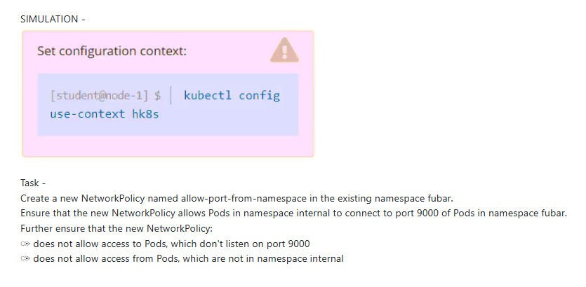

SIMULATION -


Task -

Create a new NetworkPolicy named allow-port-from-namespace in the existing namespace fubar.

Ensure that the new NetworkPolicy allows Pods in namespace internal to connect to port 9000 of Pods in namespace fubar.

Further ensure that the new NetworkPolicy:

✑ does not allow access to Pods, which don't listen on port 9000

✑ does not allow access from Pods, which are not in namespace internal

```bash
kubectl label namespace internal namespace=internal

apiVersion: networking.k8s.io/v1
kind: NetworkPolicy
metadata:
  name: allow-port-from-namespace
  namespace: fubar
spec:
  podSelector: {}
  policyTypes:
  - Ingress
  ingress:
  - from:
    - namespaceSelector:
        matchLabels:
          namespace: internal # make sure the namespace is labelled
	    ports:
	    - protocol: TCP
	      port: 9000

```