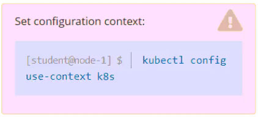

SIMULATION -


Task -
Reconfigure the existing deployment front-end and add a port specification named http exposing port 80/tcp of the existing container nginx.
Create a new service named front-end-svc exposing the container port http.
Configure the new service to also expose the individual Pods via a NodePort on the nodes on which they are scheduled.


```
apiVersion: apps/v1
kind: Deployment
metadata:
  name: front-end
  labels:
    app: nginx
spec:
  replicas: 3
  selector:
    matchLabels:
      app: nginx
  template:
    metadata:
      labels:
        app: nginx
    spec:
      containers:
      - name: nginx
        image: nginx:1.14.2
        ports:
        - containerPort: 80
          name: http

kubectl expose deployment front-end --name=front-end-service --port=80 --type=NodePort --protocol=TCP
```