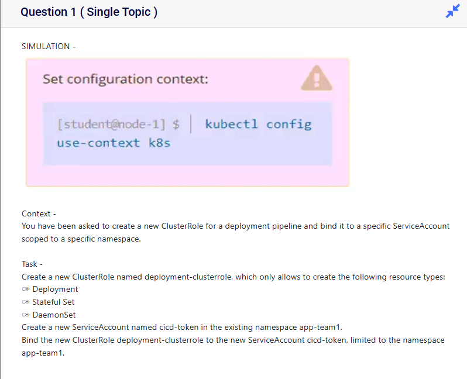

```
kubectl get namespaces
kubectl create namespace app-team1
kubectl config set-context --current --namespace=app-team1
```
# Create cluster role
https://kubernetes.io/docs/reference/kubectl/generated/kubectl_create/kubectl_create_clusterrole/
```
kubectl create clusterrole deployment-clusterrole --verb=create --resource=deployments,statefulsets,daemonsets
```
# Create Service Account
```
https://kubernetes.io/docs/reference/kubectl/generated/kubectl_create/kubectl_create_serviceaccount/
kubectl create serviceaccount cicd-token -n app-team1
```

# Clusterrole binding
```
https://kubernetes.io/docs/reference/kubectl/generated/kubectl_create/kubectl_create_clusterrolebinding/
kubectl create clusterrolebinding deployment-clusterrole-binding --clusterrole=deployment-clusterrole --serviceaccount=app-team1:cicd-token
```