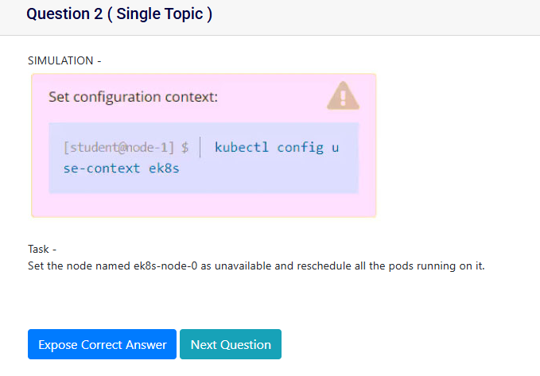

Task -
Set the node named ek8s-node-0 as unavailable and reschedule all the pods running on it.

```
# to set unavailable, need to cordon it
# to reschedule all the pods running on it, need to drain it

kubectl get nodes
kubectl cordon ek8s-node-0
kubectl drain ek8s-node-0
kubectl get nodes
```